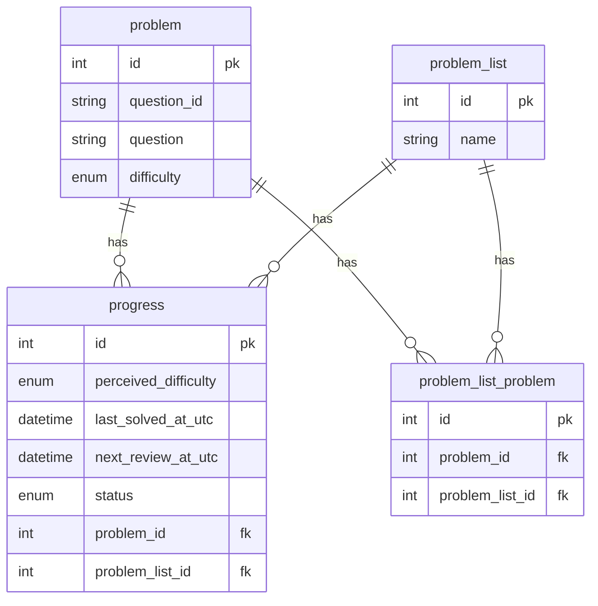

```mermaid
erDiagram

progress {
  int id pk
  enum perceived_difficulty
  datetime last_solved_at_utc
  datetime next_review_at_utc
  enum status
  int problem_id fk
  int problem_list_id fk
}

problem {
  int id pk
  string question_id
  string question
  enum difficulty
}

problem_list_problem {
  int id pk
  int problem_id fk
  int problem_list_id fk
}

problem_list {
  int id pk
  string name
}

problem ||--}o progress : has
problem ||--}o problem_list_problem : has
problem_list ||--}o problem_list_problem : has
problem_list ||--}o progress : has
```
